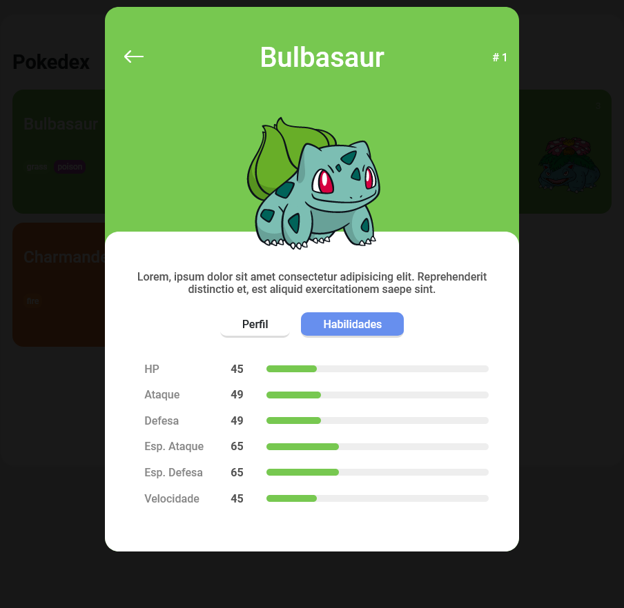

<h1 align="center">🏆 Desafio de projeto Pokedex</h1>

  Foi sugerido como desafio do módulo 2 do curso de Formação JavaScript Developer , a criação de uma aplicação que fosse capaz de receber dados de uma API externa e o desenvolvimento do layout para essa API.

<h2>Conheça o projeto clicando na imagem abaixo:</h2>

<h2 id="features">✨ Features</h2>

- Listagem de pokemons
- UI Responsiva
- Modal com HTML , CSS e JS puro
- Consumo de API Rest

<h2 id="topics">📦 Temas abordados</h2>

O projeto possui como intuito aplicar os conceitos abordados na Trilha de Javascript da <a href="https://dio.me">DIO</a>,

Recursos presentes no projeto:
- HTML 5
- Flexbox
- Responsividade
- Transições
- API REST